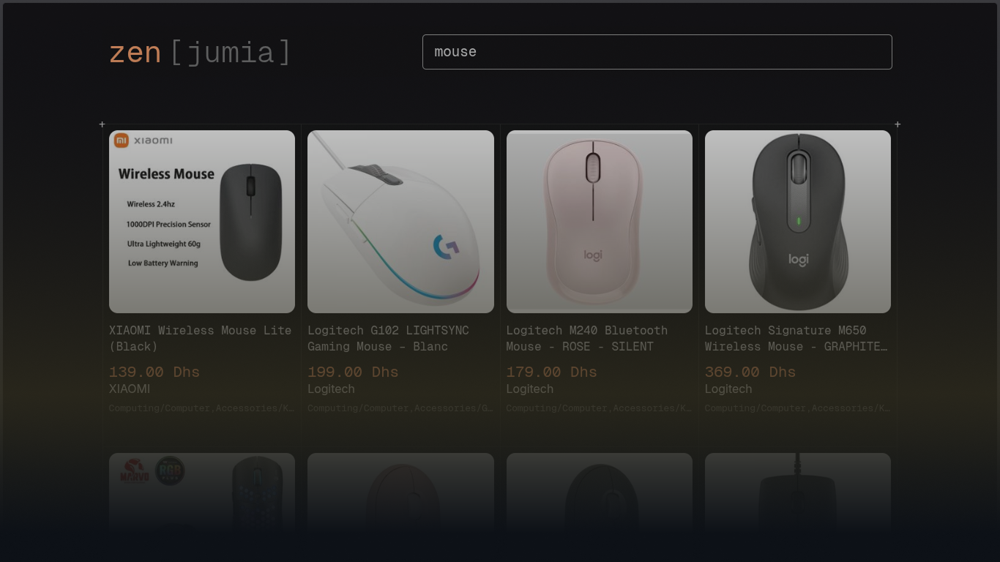

# zen [jumia]
this is a simple web scraping project that scrapes Jumia products using node/express and cheerio(html parser).
beyond the learning purposes, I made this project as to be a calmer, less distracting and more "zen" way to browse jumia's products.
## how to run
1 - clone the project (you know the drill)

2 - build the server
```sh
pnpm install # or npm install 
pnpm run build
```

3 - build the client (front-end) 
```sh
cd client
pnpm install # or npm install 
pnpm run build # or pnpm run build
```
4 - run the server 
```sh
cd .. #(if you're still in /client)
pnpm run start # http://localhost:3000
```

**note**: server logs are saved to `./logs/server.log` 